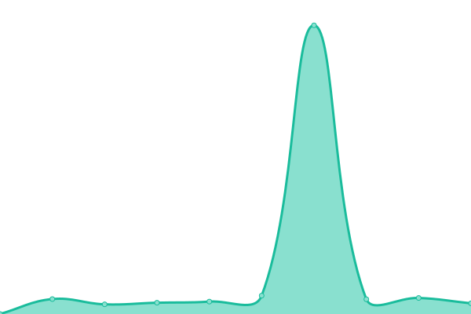

# [📈 在线统计](https://status.fangkehou.eu.org): <!--在线统计--> **🟩 系统运转正常**

This repository contains the open-source uptime monitor and status page for [Team Fangkehou](https://www.fangkehou.eu.org), powered by [Upptime](https://github.com/upptime/upptime).

With [Upptime](https://upptime.js.org), you can get your own unlimited and free uptime monitor and status page, powered entirely by a GitHub repository. We use [Issues](https://github.com/fangkehou-team/fangkehou_status/issues) as incident reports, [Actions](https://github.com/fangkehou-team/fangkehou_status/actions) as uptime monitors, and [Pages](https://status.fangkehou.eu.org) for the status page.

## [📈 Live Status](https://demo.upptime.js.org): <!--live status--> **🟥 全部异常**

<!--start: status pages-->
<!-- This summary is generated by Upptime (https://github.com/upptime/upptime) -->
<!-- Do not edit this manually, your changes will be overwritten -->
<!-- prettier-ignore -->
| URL | 状态 | 历史 | 响应时间 | 在线率 |
| --- | ------ | ------- | ------------- | ------ |
|  [Home 主页](https://www.fangkehou.eu.org) | 🟥 下线 | [home.yml](https://github.com/fangkehou-team/fangkehou-status/commits/HEAD/history/home.yml) | 

 2194ms
     
 | 

<a href="https://status.fangkehou.eu.org/history/home">0.00%</a>
    

|  [Blog博客](https://blog.fangkehou.eu.org) | 🟥 下线 | [blog.yml](https://github.com/fangkehou-team/fangkehou-status/commits/HEAD/history/blog.yml) | 

 2202ms
     
 | 

<a href="https://status.fangkehou.eu.org/history/blog">0.00%</a>
    

|  [Gravatar 代理](https://gravatar.fangkehou.eu.org) | 🟥 下线 | [gravatar.yml](https://github.com/fangkehou-team/fangkehou-status/commits/HEAD/history/gravatar.yml) | 

 0ms
     
 | 

<a href="https://status.fangkehou.eu.org/history/gravatar">0.00%</a>
    

<!--end: status pages-->

[**Visit our status website →**](https://status.fangkehou.eu.org)

## 📄 License

- Powered by: [Upptime](https://github.com/upptime/upptime)
- Code: [MIT](./LICENSE) © [Team Fangkehou](https://www.fangkehou.eu.org)
- Data in the `./history` directory: [Open Database License](https://opendatacommons.org/licenses/odbl/1-0/)
